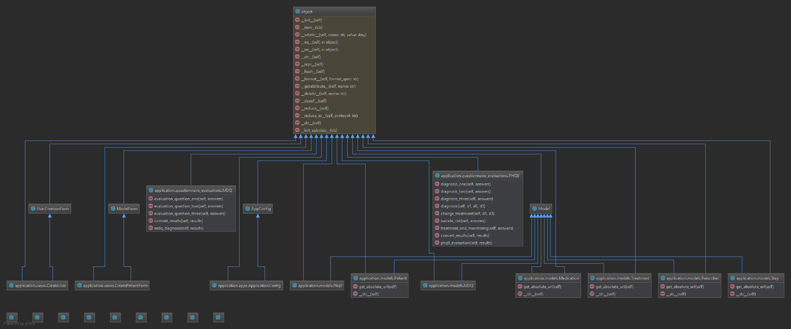

# Psychiatric Prescribing Guide: Developer Support
Webapp to automate the Prescribing Pocket Guide 2012 process.
[User Documentation](https://github.com/Brick7Face/psychiatric-guide-app/blob/development/User_Documentation.md) can be found by clicking on the link.

# 1. Obtain the source code

---
The latest code for this web application is located at
  [https://github.com/Brick7Face/psychiatric-guide-app](https://github.com/Brick7Face/psychiatric-guide-app).

## 1.1 Source code for latest stable/released version

The source code for the latest releases can be found on the opening page of the website above on the master branch.
The releases themselves can be found on the releases tab.

## 1.2 Source code for development

The development source code is found on the branch "development" in the branches tab.

# 2. Directory Layout

---

The directory layout of the application consists primarily of the main directory `/psychiatric-guide-app`, two subdirectories `/application` and `/psychiatric_guide_app`, and a template directory `/application/templates/application`.

Inside `/application`, there are other directories. The migrations directory contains information about previous database migrations, which is only necessary when using the local database (explained in another section). The `./static` directory contains files necessary for deployment to the Google Cloud server. `./templates` contains the HTML files for all the site pages. The Python files located in `/application` are from the Django tool and are edited as necessary - documentation for them can be found through [Django's site](https://docs.djangoproject.com/en/2.1/).

The directory at `/psychiatric_guide_app/psychiatric_guide_app` contains files for settings, url routes, and wsgi for the overall project. The directory at `/psychiatric_guide_app/application` contains files to render requests and control urls at links within `/application`. More about these files can also be found through [Django's site](https://docs.djangoproject.com/en/2.1/).

To access, edit, and view HTML source files, locate the directory at `/application/templates/application`. Design ideas and wireframes are located in `/adobeXDfiles`. Any folders that begin with a "." are generated by automation services, as well as those containing `*.egg` and the `pycache` folder. The `/images` directory contains images used in the documentation. The `/sonarcloud` directory contains files for the SonarCloud code analysis tool, provided by SonarQube. The `/test directory` contains files necessary for testing the project. The directories necessary to most development are the `/psychiatric_guide_app` and `/application` folders, though the rest generally needs to be included.

Any further questions about directory layout can be addressed to any of the developers through GitHub.

# 3. Using the software

---

## 3.1 How to compile/build:

### Running locally: 
- First use pip to install the Python requirements On Windows: 
`pip install -r requirements.txt` 
On Linux\MacOS: 
`pip3 install -r requirements.txt` 
- Next, use the command to run the Django server locally: 
On Windows: 
`python manage.py runserver` 
On Linux/MacOS: 
`python3 manage.py runserver` 
This will host the application on local host at [http://127.0.0.1:8000/](http://127.0.0.1:8000/). If page accesses are failing, you may need to migrate the local database. To do so: 
On Windows: 
`python manage.py makemigrations` 
And then: 
`python manage.py migrate` 
On Linux/MacOS: 
`python3 manage.py makemigrations` 
And then: 
`python3 manage.py migrate` 

To interact with the Google Cloud SQL database: 
Our software uses Google Cloud SQL as its database service. In order to interact with this database when running the
software locally, the following steps need to be completed. First, the Google Cloud SDK needs to be downloaded and
installed at [https://cloud.google.com/sdk/](https://cloud.google.com/sdk/) After installing the SDK, run the command
`gcloud auth login` to sign in. 

In order to interact with Cloud SQL you will need to run the proxy 
On Windows: 
`cloud_sql_proxy.exe -instances="psychiatric-guide:us-west1:psychiatric-guide-db"=tcp:3306` 
On Linux: 
`./cloud_sql_proxy -instances="psychiatric-guide:us-west1:psychiatric-guide-db"=tcp:3306` 
If that command is not found on Linux, use `chmod u+x cloud_sql_proxy` and then the command above. 
On MacOS: 
`./cloud_sql_proxy_mac -instances="psychiatric-guide:us-west1:psychiatric-guide-db"=tcp:3306` 
If that command is not found on MacOS, use `chmod u+x cloud_sql_proxy_mac` and then the command above. 
If there is still an error, contact bryanplant on Github for access information.

After starting the proxy, you will need to the environment variable USE_CLOUD_SQL=True this can be done while running different commands, for example to migrate the cloud sql database: 
On Windows: 
`set USE_CLOUD_SQL=True && python manage.py migrate` 
Make sure to set the environment variable to False if you want to use the local database again. The python command may also need to be `python3` instead of `python` depending on your OS as above.

## 3.2 How to test:

We have setup unit tests to run automatically in a script through Travis CI, which is detailed below. Alternatively, tests
 can be run from the command line in the root directory with the command
 `python setup.py test`. To write tests, either add test cases to the `/tests/tests.py` file or add new files to the tests directory. These files should be named with the word test first, in the format `test*.py.`

 Running the test suite from the command line will automatically print out what tests passed and failed, what percent of each file under test was covered, and a total coverage measure. The functional code that was tested was covered and tests can be viewed in the `tests/tests.py` file. Upon our most recent coverage analysis of our test suite, we achieved `41%` coverage. More detailed information can be found in the `.coverage` in the root directory of the project. This percentage is low because the testing framework tests files in the `/application` package, and a lot of these files are generated files or contain simple boilerplate for Django functionalities that can't be explicitly tested. For example, a lot of code in `models.py` and `views.py` is not accessible through unit tests, and all the migrations are covered by the test suite when they are not necessary to test. Moving around the files is not possible since the Django functionality depends on the current directory structure, and the testing framework tests by packages instead of individual files. However, important functionality that we wrote has been covered in our test suite.

 Additionally, our project uses the code analysis tool [SonarCloud](https://sonarcloud.io/), available from SonarQube. To run the analysis, after setting up SonarCloud on the local machine, use the command 
 `sonar-scanner -D"sonar.projectKey=Brick7Face_psychiatric-guide-app" -D"sonar.organization=brick7face-github" -D"sonar.sources=." -D"sonar.host.url=https://sonarcloud.io" -D"sonar.login=3ea10bb00bffd52c5e9a8e1196a646ddfb7a1eec"` 
 This will generate a code report available on the corresponding [SonarCloud dashboard](https://sonarcloud.io/dashboard?id=Brick7Face_psychiatric-guide-app) for the project. Make sure to add the `/sonarcloud/sonar-scanner.*/bin` directory to your path before execution.

 The app has been tested on Google Chrome, Mozilla Firefox, and Safari, and should work on all modern browsers. The display generally is scaled best for a screen at least 1920x1080p resolution, but still works on lower resolutions.

### 3.2.1 How to set up an automated weekly (or more frequent) build and test

For automated testing, our application uses the Travis CI tool. This tool is openly available at
[https://travis-ci.org/](https://travis-ci.org/). To use it in a project, one simply has to sign in with their
Github account and the tool will automatically detect projects from that account. A switch can then be toggled
next to the project in question to enable the tool to watch that project. Within the top directory of that project,
 the .travis.yml file specifies how to automatically run tests daily and whenever a new commit is pushed to Github.
 When tests fail, the contributors to the project are emailed, and the person who pushes the commit always gets
 emailed either way. These automatic tests can be configured to run daily, weekly, or monthly from the Travis CI
 website. Our tests run daily. The results of the test suite are displayed beside the commit on Github, though more
 details are available from the Travis CI website.

Our .travis.yml file simply specifies the language to use, the version of that language makes sure that the correct
dependencies are installed based on the included requirements.txt file, and then runs a script where our unit tests
are located.

## 3.3 Project design overview

### 3.3.1 Design decisions

For this application, it is assumed that only the prescribing physicians will be using the product. The only instance in which a patient will come into contact with the application will be to fill out a PHQ9 or MDQ. It is also assumed that a patient will fill out a questionnaire at every appointment.

Prescribers are not limited to a specified number of patients and can see a list of all patients on the Patients page. As seen in section 3.3.2 each patient has multiple characteristics:
- can be prescribed zero to many medications at one time
- can have multiple PHQ9 or MDQ submissions
- can have one Treatment plan and will be at only one step of that plan at a time.

If logging in as an administrator, other features are available, such as access to the admin site. There, objects stored in the database can be edited or deleted. Functionality related to users is available on the front-end, however, such as editing a patient's attributes. For information on how to use the site from a user perspective, see the [User Documentation](https://github.com/Brick7Face/psychiatric-guide-app/blob/development/User_Documentation.md).

Algorithms available are those specified in the Prescribing Pocket Guide 2012; specifically, treatment options for depression, bipolar depressed, and bipolar manic disorders. The steps and order are available through the site; however, if new algorithms need to be added or steps manipulated, it is assumed that the developers would do this. Adding the option for a prescriber to do this was outside of the scope of this project, and so the software would come preconfigured with the necessary algorithms for a prescriber. However, editing objects that would require frequent updating is available to the client through the admin site, which simply requires the correct credentials. This particular design decision was specified by the client while developing this project.

Additionally, programming practices used while developing took the [Cerner compatible practices](https://fhir.cerner.com/millennium/dstu2/) into account. The app was submitted to Cerner for review on
4/24/19. Information about whether or not they accepted will be provided in the future, though the review process often takes a month to six weeks.

### 3.3.2 Class diagram for prescriber - patient relationship

# 4. How to release a new version

---

Our application is hosted on Google App Engine. App Engine is a fully managed serverless application
platform which handles the majority of the management required to host a web application.

## 4.1 Updating revision numbers

The application should be updated in two places. First, update the version number in the
settings.py file. Secondly, **create a new release on github** with the same version
number that was updated in settings.py.

## 4.2 How to make a package that the user uses to obtain product

Use the command `python manage.py collectstatic` to create a static directory which contains the necessary
files for hosting the application on App Engine.

## 4.2 Make new version public

To make the new application version available to the public you will first need the credentials for the
Google Cloud account. Using these credentials, run `gcloud app deploy` in order to deploy the application to

  https://psychiatric-guide.appspot.com/
